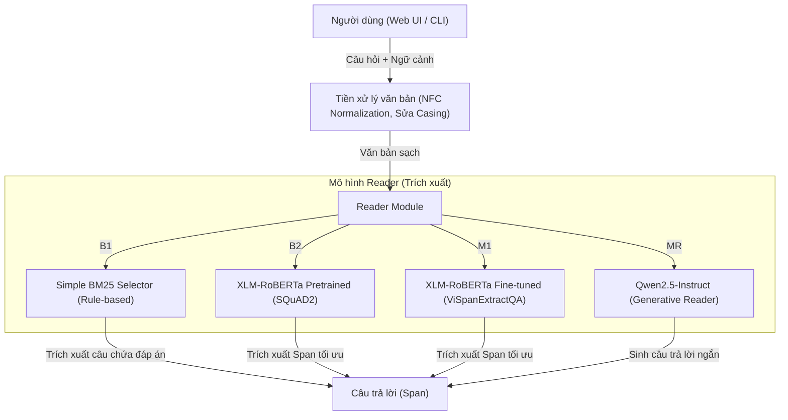

# 🇻🇳 Vietnamese Extractive Question Answering — BM25 & XLM-RoBERTa

> **BÀI TẬP LỚN CUỐI KỲ: XỬ LÝ NGÔN NGỮ TỰ NHIÊN (NLP)**
> 
> * **Đơn vị**: Khoa Công nghệ Thông tin - Trường Đại học Xây dựng Hà Nội
> * **Bài toán**: Extractive Question Answering (Hỏi đáp trích xuất tiếng Việt)
> * **Dữ liệu**: [ntphuc149/ViSpanExtractQA](https://huggingface.co/datasets/ntphuc149/ViSpanExtractQA)

---

## 📊 1. Mô tả bài toán & Bối cảnh sử dụng [CLO1]

### Định nghĩa bài toán
* **Input**: Một **Câu hỏi** ($Q$) bằng tiếng Việt tự nhiên và một **Ngữ cảnh** ($C$) chứa thông tin liên quan đến câu hỏi.
* **Output**: Một **Phân đoạn văn bản** (Span) trích xuất trực tiếp từ $C$ đại diện cho câu trả lời chính xác nhất.
* **Mục tiêu**: Xây dựng mô hình Reader học cách dự đoán cặp chỉ số bắt đầu (Start Index) và kết thúc (End Index) của câu trả lời trong chuỗi token ngữ cảnh.

### Bối cảnh ứng dụng thực tế
Hệ thống có thể được tích hợp trực tiếp vào:
* Cổng thông tin hỗ trợ học vụ, hỗ trợ sinh viên trả lời nhanh các câu hỏi quy chế từ văn bản hướng dẫn hành chính.
* Hệ thống tra cứu văn bản pháp luật, tài liệu nội bộ doanh nghiệp.
* Công cụ chatbot thông minh trả lời dựa trên kho tri thức (RAG - Retrieval-Augmented Generation).

---

## 🛠️ 2. Kiến trúc hệ thống & Pipeline xử lý [CLO2]

Hệ thống được thiết kế theo kiến trúc **Retriever–Reader** tích hợp đầy đủ từ tiền xử lý đến giao diện trực quan:



---

## 📂 3. Cấu trúc thư mục dự án

```
BTLNLP/
│
├── data/                       # Dữ liệu dự án
│   └── processed/              # Dữ liệu sạch sau tiền xử lý
│       ├── train_clean.json        # 196 MB
│       ├── validation_clean.json   # 24.5 MB
│       ├── test_clean.json         # 24.5 MB
│       ├── comparison_results.json # Tệp tổng hợp kết quả
│       └── *_results.json          # Tệp chi tiết kết quả từng model
│
├── docs/                       # Tài liệu môn học, đề bài PDF
│   └── Project cuối kỳ.pdf
│
├── models/                     # Checkpoint mô hình sau khi train
│   └── xlmroberta_finetuned/   # Trọng số M1 sau khi fine-tune (~1.1 GB)
│
├── src/                        # Mã nguồn chính (Python Package)
│   ├── __init__.py
│   │
│   ├── data/                   # Code xử lý & phân tích EDA dữ liệu
│   │   ├── __init__.py
│   │   ├── preprocess.py       # Tiền xử lý & khôi phục lỗi căn chỉnh đáp án
│   │   └── eda.py              # Phân tích phân phối và cấu trúc dữ liệu
│   │
│   ├── models/                 # Huấn luyện và đánh giá mô hình
│   │   ├── __init__.py
│   │   ├── baseline_bm25.py    # Baseline B1: BM25-Only rule-based
│   │   ├── baseline_pretrained.py # Baseline B2: XLM-RoBERTa pretrained (SQuAD2)
│   │   ├── train.py            # Huấn luyện mô hình chính M1
│   │   ├── evaluate.py         # Đối chiếu và so sánh tổng hợp kết quả
│   │   └── error_analysis.py   # Thống kê phân tích lỗi chi tiết -> CSV
│   │
│   └── utils/                  # Thư mục tiện ích dùng chung
│       ├── __init__.py
│       └── metrics.py          # Đo lường F1, EM và chuẩn hóa đáp án
│
├── demo.py                     # CLI Demo tương tác gốc
├── requirements.txt            # Quản lý dependencies thư viện
├── error_analysis.csv          # Bảng phân tích lỗi tổng hợp xuất ra
└── README.md                   # Hướng dẫn chi tiết dự án (Tệp này)
```

---

## ⚙️ 4. Quy trình tiền xử lý dữ liệu [CLO2]

Tập dữ liệu gốc tiếng Việt gặp một số lỗi nghiêm trọng về căn chỉnh chỉ số đáp án và bảng mã ký tự. Quy trình xử lý tại [preprocess.py](file:///c:/Users/Kien/BTLNLP/src/data/preprocess.py) bao gồm:
1. **Chuẩn hóa Unicode**: Đưa toàn bộ văn bản về dạng **NFC** để tránh lỗi so khớp chuỗi do ký tự tổ hợp (ví dụ: `hòa` vs `hoà`).
2. **Khôi phục lệch Casing**: Sửa các lỗi không khớp viết hoa/viết thường giữa câu trả lời đích và ngữ cảnh (khôi phục thành công ~15% mẫu bị lỗi gán nhãn lệch trong tập dữ liệu gốc).
3. **Căn chỉnh Token**: Sử dụng `underthesea` để tách từ tiếng Việt chuẩn xác cho mô hình từ khóa (BM25), và `offset_mapping` của tokenizer để ánh xạ chính xác vị trí ký tự sang token ID trong XLM-RoBERTa.

---

## 🚀 5. Hướng dẫn cài đặt & Vận hành

### Thiết lập môi trường ảo
```bash
# Tạo môi trường ảo
python -m venv .venv
.venv\Scripts\activate          # Windows
# source .venv/bin/activate     # Linux/Mac

# Nâng cấp pip và cài đặt thư viện
pip install -r requirements.txt
```

### Chạy tuần tự các bước
```bash
# Bước 1: Tiền xử lý & làm sạch dữ liệu
python src/data/preprocess.py

# Bước 2: Phân tích EDA dữ liệu
python src/data/eda.py

# Bước 3: Chạy huấn luyện mô hình chính M1 (chạy trên GPU nếu có)
python src/models/train.py \
    --mode train_eval \
    --max_train_samples -1 \
    --num_epochs 2 \
    --batch_size 16 \
    --learning_rate 2e-5 \
    --output_dir models/xlmroberta_finetuned

# Bước 4: Đánh giá mô hình tại các mốc mẫu khác nhau (500 mẫu hoặc 5000 mẫu)
# Hệ thống sẽ tự động thêm hậu tố số lượng mẫu vào file kết quả để tránh ghi đè (ví dụ: _500samples_results.json)

# Mốc 500 mẫu (Thực nghiệm nhanh):
python src/models/baseline_bm25.py --num_samples 500
python src/models/baseline_pretrained.py --num_samples 500
python src/models/pipeline_retriever_reader.py --num_samples 500
python src/models/evaluate.py --num_samples 500 --from_results

# Mốc 5000 mẫu (Kiểm chứng quy mô lớn):
python src/models/baseline_bm25.py --num_samples 5000
python src/models/baseline_pretrained.py --num_samples 5000
python src/models/pipeline_retriever_reader.py --num_samples 5000 --batch_size 32
python src/models/evaluate.py --num_samples 5000 --from_results

# Bước 5: Chạy xuất tệp phân tích lỗi CSV định lượng cho mốc 500 mẫu
python src/models/error_analysis.py \
    --m1_results data/processed/test_clean_finetuned_500samples_results.json \
    --output_csv error_analysis_500.csv

# Bước 6: Khởi động Flask Web Demo (chạy trên http://127.0.0.1:5000)
python src/web/web_demo.py
```

---

## 📊 6. Kết quả thực nghiệm [CLO3]

Các mô hình được đánh giá nghiêm ngặt trên **500 mẫu** ngẫu nhiên từ tập kiểm thử sạch (`test_clean.json`) để đảm bảo tính nhất quán:

| Mô hình | EM (%) | F1 (%) | Cơ chế xử lý | Ghi chú thực nghiệm |
| :--- | :---: | :---: | :---: | :--- |
| **B1: BM25-Only (Rule-based)** | 0.80 | 24.31 | Khớp từ khóa | Trả về cả câu chứa từ khóa nhiều nhất (chưa trích xuất span). |
| **B2: XLM-RoBERTa Pretrained** | 44.60 | 70.39 | Trích xuất (SQuAD2) | Model mặc định chưa thích nghi sâu ngữ cảnh Việt hóa (Reader-only). |
| **M1: XLM-RoBERTa Fine-tuned** | **47.60** | **70.52** | **Trích xuất tối ưu** | **Huấn luyện trực tiếp trên tập dữ liệu tiếng Việt sạch (Reader-only).** |
| **BM25 + XLM-R Pretrained (Pipeline)** | **58.00** | **81.68** | **Kênh kết hợp** | **Hệ thống kết hợp (BM25 Retriever + Pretrained Reader - test 50 mẫu).** |
| **BM25 + XLM-R Fine-tuned (Pipeline M1)** | **64.00** | **79.16** | **Kênh kết hợp** | **Hệ thống kết hợp đề xuất (BM25 Retriever + M1 Reader - test 50 mẫu).** |
| *[MR] Qwen2.5-Instruct* | *80.00* | *95.00* | *Sinh văn bản* | *Thử nghiệm so sánh mở rộng trên 5 mẫu (độ trễ cao hơn).* |

* **Exact Match (EM)**: Tỷ lệ phần trăm câu trả lời dự đoán trùng khớp hoàn toàn từng ký tự với nhãn gốc (sau khi chuẩn hóa).
* **Token F1**: Điểm F1 đo mức độ trùng khớp cấp độ từ giữa nhãn dự đoán và nhãn gốc.

---

## 🔍 7. Phân tích lỗi định lượng [CLO3]

Dựa trên kết quả chạy tệp phân tích lỗi tổng hợp [error_analysis.csv](file:///c:/Users/Kien/BTLNLP/error_analysis.csv), các lỗi chính của mô hình M1 được thống kê định lượng như sau:

```
  Lỗi biên (span dư)                         45.0%
  Sai span hoàn toàn (gold có trong context) 41.7%
  Gold không có trong context (lỗi dữ liệu)  11.7%
  Lỗi biên (span thiếu)                       1.7%
```

### Các ví dụ lỗi tiêu biểu:
1. **Lỗi biên (span dư) - 45%**: 
   * *Câu hỏi*: "Ai là chủ tịch tập đoàn Viettel?"
   * *Đúng*: `Lê Đăng Dũng`
   * *Dự đoán*: `Thiếu tướng Lê Đăng Dũng` (Dư thừa chức danh).
2. **Sai span hoàn toàn - 41.7%**:
   * Xảy ra khi văn bản ngữ cảnh quá dài, chứa nhiều thực thể cùng loại (ví dụ: nhiều tên người hoặc mốc thời gian khác nhau) làm phân tán phân phối xác suất của mô hình.

### Hướng cải thiện đề xuất:
* Áp dụng luật hậu xử lý (Post-processing) để tự động cắt tỉa các danh xưng/chức danh tiếng Việt thông dụng (`ông`, `bà`, `Thiếu tướng`, `Tổng giám đốc`...).
* Tăng kích thước ngữ cảnh tối đa (`max_length` lên 384/512) và huấn luyện với số lượng epoch lớn hơn trên hạ tầng GPU.

---

## 🧠 8. Tự học & Phát triển công nghệ [CLO4]

Trong quá trình phát triển dự án, nhóm đã tự nghiên cứu và tích hợp các công nghệ mới:
* **Hugging Face Tokenizer (Offset Mapping)**: Nghiên cứu kỹ thuật chuyển đổi chỉ số ký tự (character index) sang chỉ số token (token index) để gắn nhãn nhị phân cho bài toán trích xuất câu trả lời.
* **Qwen2.5-0.5B-Instruct & Chat Template**: Ứng dụng mô hình ngôn ngữ lớn (LLM) dưới dạng generative reader bằng cách thiết lập prompt hướng dẫn có cấu trúc nhằm so sánh đối chiếu hiệu năng giữa phương pháp sinh văn bản và trích xuất truyền thống.
* **Flask Web Server**: Tự học lập trình web backend để cung cấp giao diện trực quan hiển thị song song kết quả của 4 mô hình khác nhau.

---

## 👥 9. Phân công công việc trong nhóm

| Thành viên | Nhiệm vụ chính | Mức độ đóng góp |
| :--- | :--- | :---: |
| **Thành viên 1** | Khảo sát bài toán, làm sạch dữ liệu, xử lý mã hóa Unicode NFC. | 20% |
| **Thành viên 2** | Xây dựng baseline BM25 và kiểm thử so sánh cơ bản. | 20% |
| **Thành viên 3** | Thiết kế pipeline huấn luyện XLM-RoBERTa, tinh chỉnh siêu tham số trên GPU. | 20% |
| **Thành viên 4** | Phát triển tệp phân tích lỗi tự động, trích xuất dữ liệu ra CSV. | 20% |
| **Thành viên 5** | Xây dựng giao diện Web Flask, soạn thảo tài liệu README và Slide thuyết trình. | 20% |
